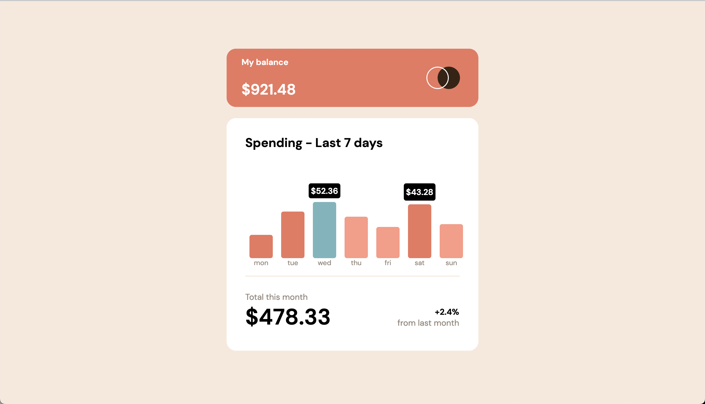

# Frontend Mentor - Expenses chart component solution

This is a solution to the [Expenses chart component challenge on Frontend Mentor](https://www.frontendmentor.io/challenges/expenses-chart-component-e7yJBUdjwt). Frontend Mentor challenges help you improve your coding skills by building realistic projects. 

## Table of contents

- [Overview](#overview)
  - [The challenge](#the-challenge)
  - [Screenshot](#screenshot)
  - [Links](#links)
- [My process](#my-process)
  - [Built with](#built-with)
  - [What I learned](#what-i-learned)
  - [Continued development](#continued-development)
  - [Useful resources](#useful-resources)
- [Author](#author)

**Note: Delete this note and update the table of contents based on what sections you keep.**

## Overview

The solution is in the branch *develop*

### The challenge

Users should be able to:

- View the bar chart and hover over the individual bars to see the correct amounts for each day
- See the current day’s bar highlighted in a different colour to the other bars
- View the optimal layout for the content depending on their device’s screen size
- See hover states for all interactive elements on the page
- **Bonus**: Use the JSON data file provided to dynamically size the bars on the chart

### Screenshot

### Links

- Solution URL: [Github - Expenses Chart](https://github.com/thihnezzy/expenses-chart-component)
- Live Site URL: [Expenses Chart](https://expenses-chart-component-sigma.vercel.app/)

## My process

### Built with

- Pure HTML/CSS
- Javascript
- Deploy with Vercel
### What I learned

- Using Async/Await function
- Get familiar with EventListener
- Improve HTML/CSS coding time

### Continued development

In this exercise/project, I didn't finish the responsive for mobile. I want to focus on desktop-first and master it. After that, I will continue to code for mobile design.

### Useful resources

- [Learn Async/Await](https://www.youtube.com/watch?v=J29jeuyMJ38&t=1054s&ab_channel=ThuNghiem) - This helped me have a better view of using Async/Await to get data from data.json

## Author

- Website - [Expenses Chart](https://www.your-site.com)
- Frontend Mentor - [@thihnezzy](https://www.frontendmentor.io/profile/nobody1234455)